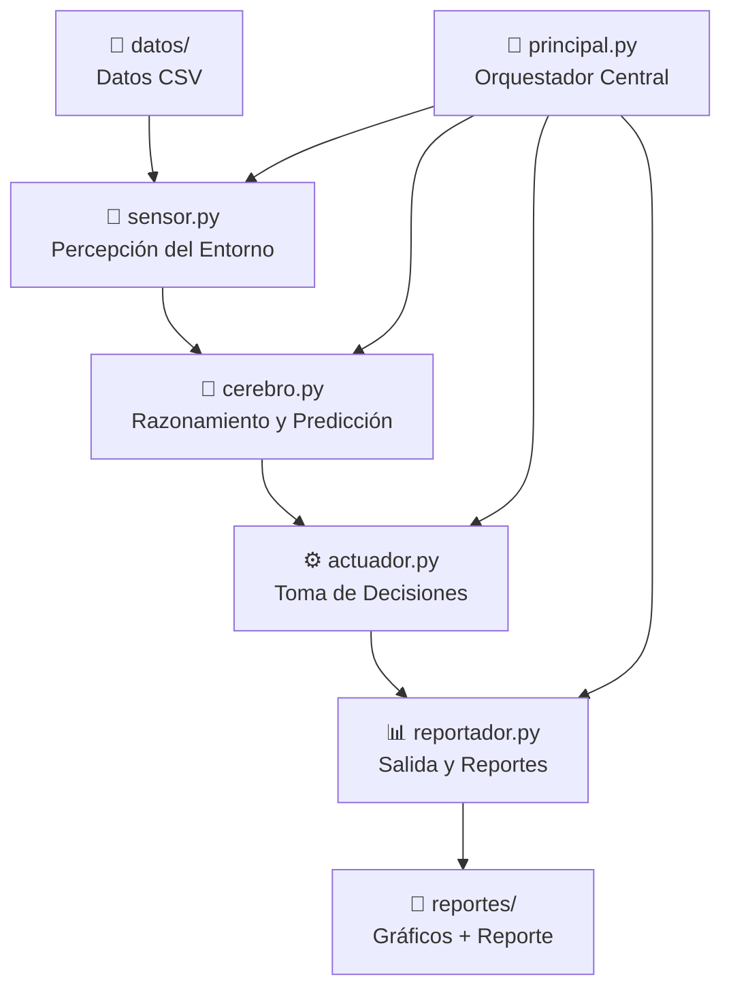

# 📊 Pymevision AI — Agente Inteligente Autónomo de Predicción y Optimización de Inventario

> **Agente Inteligente de IA diseñado para optimizar el inventario de PYMEs (bodegas) mediante modelos predictivos y toma de decisiones autónoma.**

Este proyecto implementa un sistema inteligente modular compuesto por sensores, modelos de razonamiento (cerebro), actuadores y reportadores. Su objetivo es predecir la demanda de productos, simular operaciones comerciales diarias y emitir alertas preventivas para evitar quiebres de stock y pérdidas por vencimiento de productos.

---

## 🏗️ Arquitectura del Proyecto

El sistema está diseñado de manera modular siguiendo una arquitectura clásica de agente inteligente autónomo:



### Detalle de Módulos:

1. **🔬 [sensor.py](file:///modulos/sensor.py)**: Se encarga de la percepción. Carga, limpia y realiza el preprocesamiento defensivo de los datos históricos.
2. **🧠 [cerebro.py](file:///modulos/cerebro.py)**: Módulo de razonamiento y modelos predictivos:
   - **Facebook Prophet**: Modelado de series temporales diarias para predicción de demanda a largo plazo.
   - **Perceptrón Multicapa (MLPRegressor)**: Red neuronal entrenada para detectar patrones de venta por hora y factores como feriados o fines de semana.
   - **Red Bayesiana Noisy-OR**: Evaluación causal de riesgos de quiebre de stock optimizando la complejidad computacional.
3. **⚙️ [actuador.py](file:///modulos/actuador.py)**: Toma decisiones y genera alertas sobre riesgos de vencimiento, picos de feriados, horas pico de ventas y riesgos de quiebres.
4. **📊 [reportador.py](file:///modulos/reportador.py)**: Genera visualizaciones e informes detallados del comportamiento de la simulación y de la proyección del inventario en formato gráfico.
5. **🎯 [principal.py](file:///principal.py)**: El orquestador secuencial que ejecuta la simulación diaria autónoma (Junio–Agosto) y calcula las proyecciones futuras (Septiembre).

---

## 🛠️ Requisitos e Instalación

Para instalar y ejecutar este proyecto en tu computadora, sigue los pasos detallados a continuación:

### 1. Requisitos Previos
* **Python**: Versión 3.10 o superior.
* Una clave de API de **Gemini** (si vas a utilizar las funciones de LLM/Chatbot).

---

### 2. Pasos de Instalación

#### Paso A: Clonar o descargar el repositorio
Descarga este proyecto como un archivo ZIP y extráelo, o clónalo utilizando Git:
```bash
git clone https://github.com/AlvaroJesusC/agente_ia_movil.git
cd agente_ia_movil
```

#### Paso B: Crear y activar un entorno virtual (Recomendado)
Aísla las dependencias del proyecto creando un entorno virtual de Python:

* **En Windows (PowerShell):**
  ```powershell
  python -m venv .venv
  .venv\Scripts\Activate.ps1
  ```
* **En Windows (CMD):**
  ```cmd
  python -m venv .venv
  .venv\Scripts\activate.bat
  ```
* **En macOS/Linux:**
  ```bash
  python3 -m venv .venv
  source .venv/bin/activate
  ```

#### Paso C: Instalar las dependencias
Una vez activado el entorno virtual, instala las librerías del proyecto principal:
```bash
pip install -r requirements.txt
```

Si planeas utilizar la API basada en FastAPI, instala también sus dependencias correspondientes:
```bash
pip install -r api/requirements.txt
```

#### Paso D: Configurar variables de entorno
Crea un archivo llamado `.env` en la raíz del proyecto y agrega tu API Key de Gemini:
```env
GEMINI_API_KEY=tu_clave_de_api_aqui
```

---

## 🚀 Ejecución del Sistema

### 1. Ejecutar el Agente y la Simulación Central
Para iniciar la simulación diaria automatizada, generación de alertas y reportes gráficos en la carpeta `reportes/`, ejecuta:
```bash
python principal.py
```

### 2. Ejecutar la API Localmente
El proyecto incluye un backend web desarrollado con FastAPI para consumir el estado del agente inteligente:
```bash
uvicorn api.main:app --reload
```
Una vez iniciado, podrás interactuar con la documentación de la API en `http://127.0.0.1:8000/docs`.

### 3. Ejecutar con Docker 🐳
Si prefieres empaquetar y ejecutar la API mediante contenedores Docker:

1. **Construir la imagen:**
   ```bash
   docker build -t pymevision-api -f api/Dockerfile .
   ```
2. **Ejecutar el contenedor:**
   ```bash
   docker run -p 8000:8000 --env-file .env pymevision-api
   ```

---

## 📂 Estructura de Directorios

```text
├── api/                   # Código de la API web con FastAPI y Dockerfile
├── datos/                 # Datasets históricos y resultados de la simulación
├── modulos/               # Lógica del Agente (Sensor, Cerebro, Actuador, etc.)
├── recursos/              # Scripts auxiliares y de regeneración de datos
├── reportes/              # Reportes detallados y gráficos generados por el Reportador
├── principal.py           # Orquestador del ciclo de simulación principal
├── requirements.txt       # Dependencias principales del sistema
└── README.md              # Documentación del proyecto (este archivo)
```
