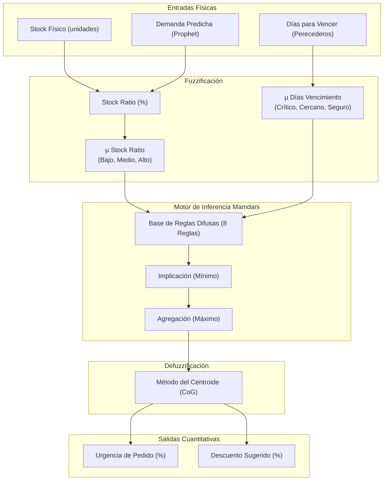

# 📊 Reporte Técnico: Implementación del Sistema Lógico Difuso

**Proyecto:** Pymevision AI — Agente Inteligente de Optimización de Inventario  
**Autor:** Agente Inteligente Antigravity  
**Fecha:** Julio 2026  

---

## 1. Comparativa y Diagnóstico: Borrador vs. Código Real

El borrador propuesto en la sección **2.10 Implementación del sistema difuso o chatbot** presenta un esquema simplificado y estático. Sin embargo, el código real implementado en [sistema_difuso.py](file:///c:/Users/AlvaroJ/Documents/Antigravity%20Projects/agente_ia_movil/modulos/sistema_difuso.py) es un sistema lógico difuso de tipo **Mamdani** mucho más avanzado, dinámico y escalable.

A continuación se detallan las diferencias clave y por qué la implementación del código es superior:

| Característica | Borrador Propuesto | Implementación Real en Código | Justificación Técnica |
| :--- | :--- | :--- | :--- |
| **Entrada Principal** | `Stock_Actual` en unidades absolutas ($[0, \ge 20]$). | **Stock Ratio (%)** relativo a la demanda proyectada: $\frac{\text{Stock Actual}}{\text{Demanda Estimada 7d}} \times 100$. | **Escalabilidad:** Un stock de 10 unidades es crítico para un producto de alta rotación (ej. Inca Kola) pero excesivo para uno de baja rotación. Al usar un porcentaje relativo a la predicción de Prophet, el sistema se auto-ajusta a cada producto. |
| **Segunda Variable** | No definida. | **Días para Vencer (Vencimiento)** en días ($[0, 30]$) para productos perecederos. | **Control de Mermas:** Permite al agente sugerir descuentos preventivos agresivos si el producto está próximo a vencer y hay sobre-stock. |
| **Variables de Salida** | `Prioridad_Alerta` (Cualitativa). | 1. **Urgencia de Pedido (%)** ($[0, 100]$) 2. **Descuento Sugerido (%)** ($[0, 50]$). | **Acción Cuantitativa:** El backend genera decisiones numéricas accionables (ej. "hacer pedido con urgencia 84.2%" y "aplicar descuento del 15%"). |
| **Integración** | Reglas cruzadas con Prophet y Bayesiana en lenguaje natural. | Inferencia difusa Mamdani con intersecciones matemáticas reales (funciones de membresía trapezoidales y triangulares). | **Cálculo Preciso:** Utiliza fusificación de entradas físicas, intersección de reglas por el mínimo, agregación de salidas por el máximo y defusificación mediante el **Método del Centroide**. |
| **El "Chatbot"** | Mencionado en el título. | **No existe un Chatbot de lenguaje natural (NLP).** | El módulo es puramente un motor de lógica difusa para la toma de decisiones cuantitativas de stock y precios. |

---

## 2. Arquitectura del Sistema Difuso Mamdani

El flujo de procesamiento de la información desde las variables del entorno hasta las decisiones de reabastecimiento y precio sigue esta estructura:

---

## 3. Variables Lingüísticas y Funciones de Membresía Reales

Las funciones de pertenencia (membresías) se modelan mediante funciones **triangulares** ($\mu_{\text{tri}}$) y **trapezoidales** ($\mu_{\text{trap}}$).

### A. Funciones Matemáticas Auxiliares

1. **Función Triangular:**
   $$\mu_{\text{tri}}(x; a, b, c) = \max\left(0, \min\left(\frac{x - a}{b - a}, \frac{c - x}{c - b}\right)\right)$$

2. **Función Trapezoidal:**
   $$\mu_{\text{trap}}(x; a, b, c, d) = \max\left(0, \min\left(\frac{x - a}{b - a}, 1, \frac{d - x}{d - c}\right)\right)$$

---

### B. Variables de Entrada

#### 1. Stock Ratio ($x_1 \in [0, 200\%]$)
Representa el porcentaje de cobertura del stock actual respecto a la demanda proyectada por Prophet para los próximos 7 días.

* **Bajo Stock (Rojo):** Cobertura deficiente de inventario.
  $$\mu_{\text{bajo}}(x_1) = \mu_{\text{trap}}(x_1; 0.0, 0.0, 30.0, 60.0)$$
* **Stock Medio (Naranja):** Cobertura regular o de seguridad.
  $$\mu_{\text{medio}}(x_1) = \mu_{\text{tri}}(x_1; 40.0, 60.0, 90.0)$$
* **Stock Alto (Verde):** Cobertura excedente o de tranquilidad.
  $$\mu_{\text{alto}}(x_1) = \mu_{\text{trap}}(x_1; 75.0, 100.0, 200.0, 200.0)$$

#### 2. Días para Vencer ($x_2 \in [0, 30 \text{ días}]$)
Solo aplica para productos perecederos.

* **Vencimiento Crítico:** Menos de una semana para expirar.
  $$\mu_{\text{crítico}}(x_2) = \mu_{\text{trap}}(x_2; 0.0, 0.0, 3.0, 7.0)$$
* **Vencimiento Cercano:** Entre 5 y 15 días restantes.
  $$\mu_{\text{cercano}}(x_2) = \mu_{\text{tri}}(x_2; 5.0, 10.0, 15.0)$$
* **Vencimiento Seguro:** Más de 12 días restantes.
  $$\mu_{\text{seguro}}(x_2) = \mu_{\text{trap}}(x_2; 12.0, 20.0, 30.0, 30.0)$$

---

### C. Variables de Salida

#### 1. Urgencia de Pedido ($y_1 \in [0, 100\%]$)
* **Nula:** No requiere compra.
  $$\mu_{\text{urg\_nula}}(y_1) = \mu_{\text{trap}}(y_1; 0.0, 0.0, 20.0, 45.0)$$
* **Moderada:** Planificar orden rutinaria.
  $$\mu_{\text{urg\_moderada}}(y_1) = \mu_{\text{tri}}(y_1; 30.0, 50.0, 75.0)$$
* **Crítica:** Generar orden de compra inmediata.
  $$\mu_{\text{urg\_crítica}}(y_1) = \mu_{\text{trap}}(y_1; 60.0, 80.0, 100.0, 100.0)$$

#### 2. Descuento Sugerido ($y_2 \in [0, 50\%]$)
* **Ninguno (0% - 10%):**
  $$\mu_{\text{desc\_ninguno}}(y_2) = \mu_{\text{trap}}(y_2; 0.0, 0.0, 5.0, 10.0)$$
* **Moderado (5% - 25%):**
  $$\mu_{\text{desc\_moderado}}(y_2) = \mu_{\text{tri}}(y_2; 5.0, 15.0, 25.0)$$
* **Agresivo (20% - 50%):**
  $$\mu_{\text{desc\_agresivo}}(y_2) = \mu_{\text{trap}}(y_2; 20.0, 35.0, 50.0, 50.0)$$

---

## 4. Base de Reglas Difusas Integrada

El motor ejecuta 8 reglas en total (3 para la urgencia de pedido y 5 para los descuentos de liquidación):

### Reglas de Urgencia de Pedido
* **Regla 1:** SI `Stock Ratio` es **Bajo**, ENTONCES `Urgencia` es **Crítica**.
* **Regla 2:** SI `Stock Ratio` es **Medio**, ENTONCES `Urgencia` es **Moderada**.
* **Regla 3:** SI `Stock Ratio` es **Alto**, ENTONCES `Urgencia` es **Nula**.

### Reglas de Descuento (Para Perecederos)
* **Regla 4:** SI `Stock Ratio` es **Alto** Y `Vencimiento` es **Crítico**, ENTONCES `Descuento` es **Agresivo**.
* **Regla 5 (a):** SI `Stock Ratio` es **Medio** Y `Vencimiento` es **Crítico**, ENTONCES `Descuento` es **Moderado**.
* **Regla 5 (b):** SI `Stock Ratio` es **Alto** Y `Vencimiento` es **Cercano**, ENTONCES `Descuento` es **Moderado**.
* **Regla 6 (a):** SI `Vencimiento` es **Seguro**, ENTONCES `Descuento` es **Ninguno**.
* **Regla 6 (b):** SI `Stock Ratio` es **Bajo**, ENTONCES `Descuento` es **Ninguno** (no tiene sentido rebajar si hay escasez).

---

## 5. Defuzzificación por el Método del Centroide (CoG)

Para transformar la salida difusa agregada en un valor real nítido, se utiliza la integración numérica del centroide sobre 100 puntos discretizados del rango de salida:

$$\text{Valor Defuzzificado} = \frac{\sum_{i=1}^{100} y_i \cdot \mu_{\text{agregada}}(y_i)}{\sum_{i=1}^{100} \mu_{\text{agregada}}(y_i)}$$

---

## 6. Diagramas y Gráficos Generados Realmente

El sistema genera automáticamente figuras vectorizadas de alta calidad en la carpeta del proyecto. Puede incluir estos archivos en su reporte o tesis:

1. **Curvas de Membresía de Entrada y Salida:**  
   Ubicación física: [pertenencia_variables.png](file:///c:/Users/AlvaroJ/Documents/Antigravity%20Projects/agente_ia_movil/reportes/07_sistema_difuso/pertenencia_variables.png)  
   *Muestra de forma exacta las curvas trapezoidales y triangulares para Stock Ratio, Días de Vencimiento, Urgencia y Descuento.*

2. **Superficie de Control y Curva de Decisión:**  
   Ubicación física: [superficie_decision.png](file:///c:/Users/AlvaroJ/Documents/Antigravity%20Projects/agente_ia_movil/reportes/07_sistema_difuso/superficie_decision.png)  
   *Contiene el gráfico 2D del comportamiento no-lineal de reabastecimiento y la superficie 3D que ilustra la interacción entre cobertura de stock y cercanía de vencimiento para la tasa de descuento.*

3. **Resultados de Evaluación por Producto:**  
   Ubicación física: [resultados_difusos_barras.png](file:///c:/Users/AlvaroJ/Documents/Antigravity%20Projects/agente_ia_movil/reportes/07_sistema_difuso/resultados_difusos_barras.png)  
   *Gráfico de barras que resume la urgencia y descuento de cada uno de los productos de la bodega.*

---

## 7. Recomendación para su Documento de Tesis/Informe

Se sugeriría actualizar la sección **2.10** utilizando esta terminología técnica y las fórmulas presentadas arriba. En lugar de referirse a un "chatbot", reemplace el título por **2.10 Implementación del Sistema Lógico Difuso para Control de Inventario y Precios**.

Esto le dará un sustento matemático y experimental formal a su trabajo, respaldado directamente por los scripts ejecutados en Python.
